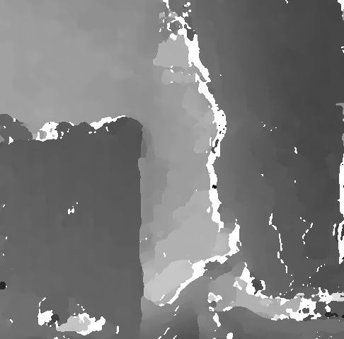
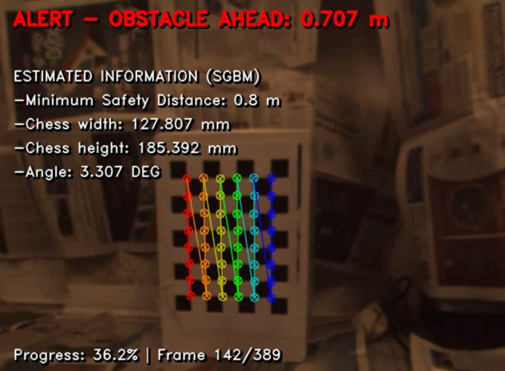
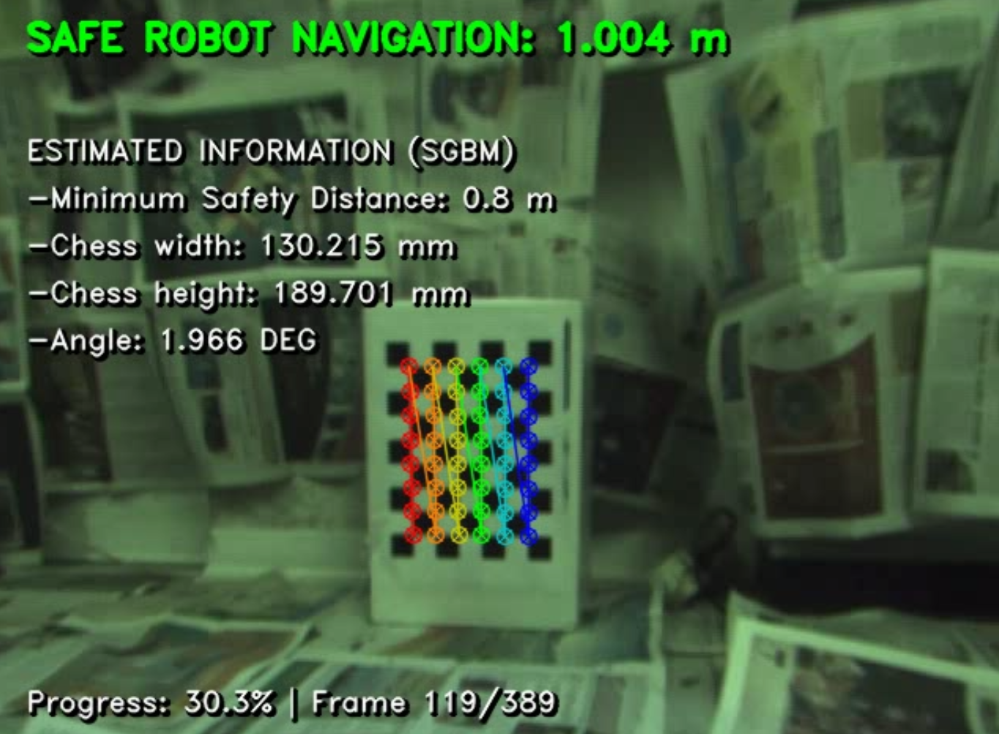
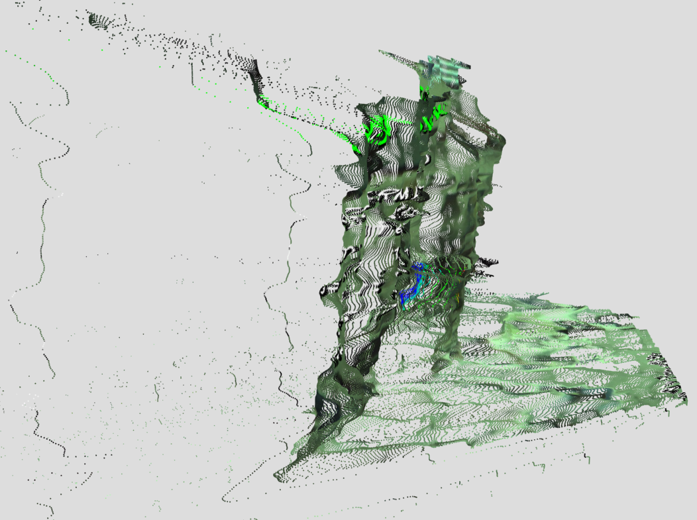
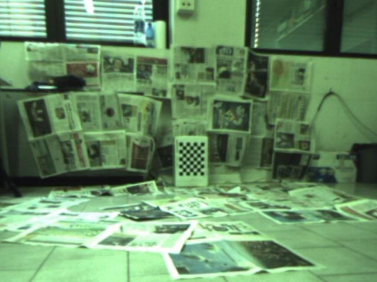
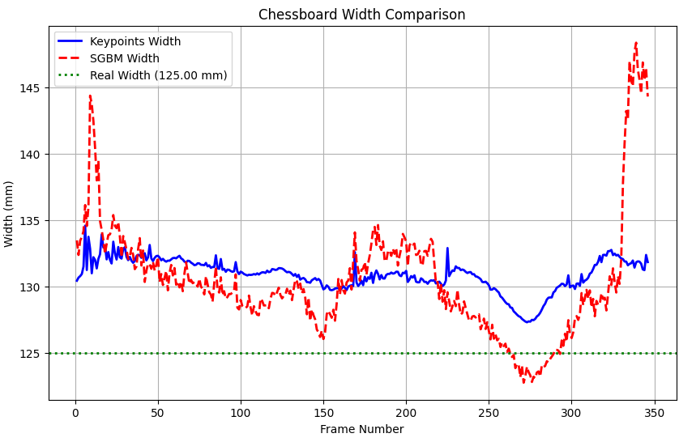

# 3D Stereo Reconstruction & Depth Estimation for Robot Navigation

[](https://www.python.org/)  
Stereo vision pipeline for real-time 3D obstacle detection and autonomous robot navigation using disparity estimation and depth reconstruction.

---

## 🧠 About the Project

This project focuses on **stereo vision-based depth estimation** for obstacle-aware robot navigation, using both **Semi-Global Block Matching (SGBM)** and **sparse matching** via chessboard corners.

Developed for the final project in **Image Processing and Computer Vision** (2025), the system allows:

- Real-time 3D reconstruction using stereo cameras  
- Safety alerts for obstacle proximity  
- Accurate depth mapping and dimensioning  
- Interactive calibration and validation with Python & OpenCV  

---

## 🗂 Project Structure

```
📦 3d-stereo-depth-ipcv/
├ 📁 Images/                            # Selected result visualizations
│ ├ 📸 depth_map.png                    # Grayscale disparity/depth map
│ ├ 📸 point_cloud.png                  # 3D reconstruction from disparity
│ ├ 📸 SGBM.png                         # Semi-Global Block Matching result
│ ├ 📸 alarm.png                        # Alarm message
│ ├ 📸 width_comparison.png             # Width estimation comparison
│ └ 📸 left_dataset.png                 # Project dataset
├ 📁 robot-navigation-video/            # Output video samples
│ ├ 🎥 output_video_final_Keypoints.avi
│ └ 🎥 output_video_final_SGBM.avi
│ └ 🎥 robotL.avi
│ └ 🎥 robotR.avi
├ 💻 IPCV_Project_Andrea_Perna.ipynb    # Full interactive notebook
├ 💻 IPCV_Project_Andrea_Perna.pdf      # Notebook output PDF
├ 💻 IPCV_Project_Andrea_Perna.html     # HTML export of notebook
├ 💻 Robot_Navigation_Project.pdf       # Project documentation
├ 💻 Project_Outcomes/                  # Evaluation & test results
├ 💻 robot_nav_pointcloud.ply           # Point cloud output
└ 📄 README.md                          # You are here!
```

---

## ⚙️ How to Run

1. Open the notebook:

```bash
$ jupyter notebook IPCV_Project_Andrea_Perna.ipynb
```

2. Execute all cells in order to:
   - Calibrate stereo camera system  
   - Compute disparity using SGBM or chessboard  
   - Reconstruct 3D space  
   - Estimate distances and generate alerts  

3. To inspect the generated point cloud:

```bash
$ meshlab robot_nav_pointcloud.ply
```

---

## 📷 Visual Outputs

<p float="left">
  
  
  
  
  
  
</p>

---

## 🔍 Technical Highlights

- **Stereo Calibration**: OpenCV chessboard-based detection  
- **Depth Estimation**: SGBM (dense) and triangulated matching (sparse)  
- **Point Cloud**: Generated and exported as `.ply`  
- **Real-Time Navigation**: Frame-based safety alerting  

---

## 📊 Evaluation & Output

- ✅ 2D and 3D visualizations  
- 🔍 Depth accuracy vs obstacles  
- 🛑 Obstacle proximity alerts  
- 🎞️ Output videos from live camera stream  

---

## 📅 Year

2025

---

## 👨‍🎓 Author

- Andrea Perna  
📧 andrea.perna3@studio.unibo.it

---

## 👩‍🏫 Supervisor

- Prof. Luigi Di Stefano

---

## 📎 Resources

- [📘 Project Report (PDF)](./Robot_Navigation_Project.pdf)  
- [📄 Notebook Output (PDF)](./IPCV_Project_Andrea_Perna.pdf)  
- [🎥 Videos](./robot-navigation-video/)  
- [🔵 Point Cloud (PLY)](./robot_nav_pointcloud.ply)  

---

## 📜 License

All rights reserved. For academic and educational use only.
